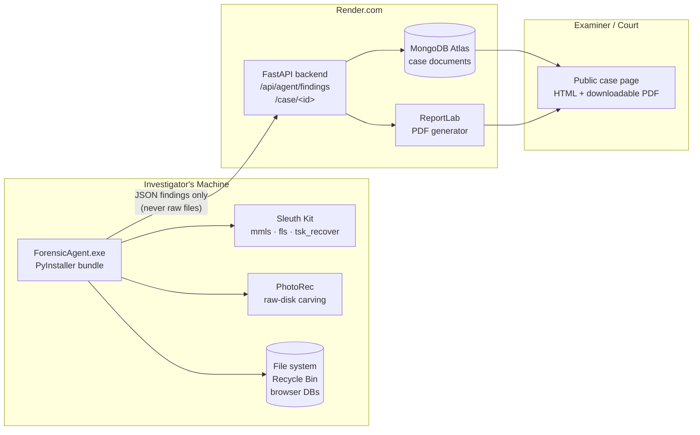
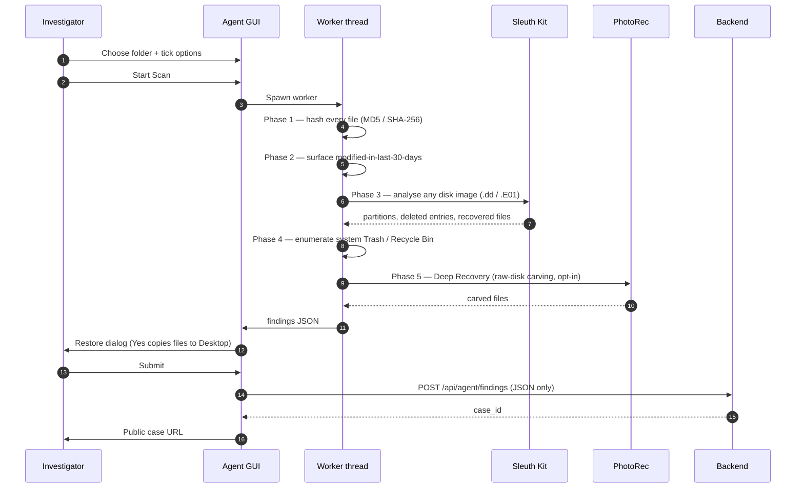

# Digital Forensics Investigation Platform

A professional, graduate-level digital forensics investigation system built with FastAPI and Python.  
Modelled after tools like Autopsy — supporting E01, DD/RAW, ISO, and logical file analysis with  
AI-powered reporting.

---

## 🌐 Live URLs

| Service | URL |
|---------|-----|
| **Live Site** | https://forensic-site.onrender.com |
| **Backend API** | https://forensic-platform-sy5q.onrender.com |
| **Frontend (Cloudflare Pages)** | https://forensic-platform.pages.dev |
| **GitHub Repository** | https://github.com/ayahmajali/forensic-platform |
| **Agent download (Windows)** | https://forensic-platform-sy5q.onrender.com/api/agent/download/windows |

> ⚠️ Render free tier sleeps after 15 min idle — first request may take ~30 seconds to wake up.

---

## 🏗️ Architecture

The platform is split into three independent surfaces — a desktop **agent**
that runs on the investigator's machine, a hosted **backend API** that stores
findings, and a public **case report** the investigator (or a court) can
view. The agent is the only component that touches raw evidence; everything
else operates on structured findings.



The agent's scan pipeline runs as a sequence of independent phases — each
phase can be skipped or fail without breaking the overall case submission:



**Privacy invariant:** evidence files never leave the investigator's
machine. Only structured findings (file paths, hashes, timestamps,
counts) are submitted to the backend. The recovered files themselves
land in `~/Desktop/RestoredFiles/<scan>-<timestamp>/` on the investigator's
local disk.

---

## ✅ Completed Features

### Desktop Agent (`ForensicAgent.exe`)
- **Self-contained Windows binary** — bundles Python + Sleuth Kit + PhotoRec; no installation required on the target machine
- **Native admin elevation** — UAC on Windows / Touch ID on macOS / PolicyKit on Linux, prompted automatically at startup
- **System Trash scan** — parses Windows `$Recycle.Bin` (`$I` sidecars) and macOS `~/.Trash`
- **Disk-image analysis** — auto-detects `.dd` / `.E01` / `.img` files in the chosen folder and runs the full Sleuth Kit pipeline
- **Deep Recovery** — opt-in raw-disk file carving via PhotoRec, with TRIM-likely warning surfaced before the scan
- **Browser history** — opt-in Chrome / Edge / Firefox / Brave / Opera / Vivaldi / Safari / Arc enumeration via SQLite
- **Restore-on-finish dialog** — after the scan, offers to copy every recoverable file into `Desktop/RestoredFiles/`
- **Backend submission** — forwards structured findings only; raw files never leave the device


### Backend Analysis Pipeline (server-side, for evidence-upload flow)
- **Evidence Type Detection** — E01, DD, RAW, IMG, ISO, logical file
- **Cryptographic Hashing** — MD5, SHA-1, SHA-256 (chain of custody)
- **Disk Image Analysis** — mmls (partitions), fsstat (filesystem), fls (all/deleted files), ils (inodes)
- **File Recovery** — tsk_recover with partition offset support
- **Browser Artifacts** — Chrome History + Firefox places.sqlite (SQLite parsing)
- **EXIF Metadata** — exiftool: GPS, camera model, serial, timestamps
- **Forensic Timeline** — fls + mactime MAC-time events (fallback: filesystem timestamps)
- **Deleted File Detection** — fls -rd with highlighted display in report
- **Media Carving** — photorec / foremost support
- **Keyword Search** — filenames, content, browser history, metadata, SQLite, emails, URLs
- **AI Summarization** — OpenAI GPT-4o-mini with local template fallback

### Frontend UI
- Beautiful modern light-themed design with Inter font
- Drag-and-drop evidence upload
- Real-time progress tracking with 9-step visual pipeline
- Investigation jobs list with status badges
- Mobile-responsive with bottom navigation bar
- Toast notifications

### Interactive Report (auto-generated HTML)
- AI Investigation Summary section
- Evidence info + hash table
- Stats cards (files, deleted, images, videos, docs, browser history)
- Disk partitions table
- Filesystem info (fsstat output)
- All files table (filterable)
- Deleted files table (highlighted red)
- Multimedia gallery (images with lightbox, video player)
- Documents catalog
- Browser history table (Chrome + Firefox)
- EXIF metadata with GPS links
- Forensic timeline table
- Keyword search results with context
- Left sidebar navigation
- Full mobile responsiveness

---

## 🗂️ Project Structure

```
forensic-platform/
├── agent/                          # Desktop investigator tool (PyInstaller-bundled)
│   ├── forensic_agent_gui.py      # Entry point for the windowed .exe
│   ├── gui.py                     # CustomTkinter UI (~2400 lines)
│   ├── scanner.py                 # System Trash + browser history scanners
│   ├── tsk_runner.py              # Sleuth Kit subprocess wrapper
│   ├── recovery.py                # PhotoRec wrapper + native admin elevation
│   ├── forensic_agent.py          # CLI entry point (no GUI)
│   ├── build_windows.bat          # PyInstaller build script for Windows
│   ├── ForensicAgent.spec         # PyInstaller spec (gitignored — built locally)
│   ├── requirements.txt           # Agent-side Python deps
│   └── vendor/
│       ├── tsk/                   # Vendored Sleuth Kit Windows binaries
│       └── testdisk/              # Vendored PhotoRec / TestDisk binaries
├── backend/
│   ├── main.py                    # FastAPI app — API routes & pipeline
│   ├── start.py                   # Server startup script
│   ├── requirements.txt           # Python dependencies
│   ├── .env.example               # Environment variables template
│   ├── templates/
│   │   ├── index.html             # Main frontend (Jinja2 template)
│   │   ├── case_report.html       # Forensic Investigation Report page
│   │   └── download_agent.html    # Agent-download landing page
│   ├── static/
│   │   ├── css/custom.css         # Global custom CSS
│   │   └── downloads/             # Published agent binaries (.exe, .zip)
│   └── modules/
│       ├── analyzer.py            # Evidence type detection + hashing
│       ├── disk_analysis.py       # Sleuth Kit disk analysis
│       ├── artifact_extractor.py  # Browser history + metadata + media
│       ├── timeline_builder.py    # MAC-time forensic timeline
│       ├── keyword_search.py      # Multi-source keyword search
│       ├── report_generator.py    # Interactive HTML report generator
│       └── ai_summary.py          # OpenAI GPT summarization
├── cloudflare-frontend/
│   ├── index.html                 # Static frontend for Cloudflare Pages
│   ├── _worker.js                 # Cloudflare Worker (proxies /api/* to Render)
│   └── _routes.json               # Cloudflare routing config
├── api/
│   └── index.py                   # Vercel ASGI entry point (legacy)
├── docs/
│   ├── DEMO_SCRIPT.md             # Defense-day click-by-click runbook
│   └── documentation.html         # Full technical documentation
├── Dockerfile                     # Container image for Render deploy
├── render.yaml                    # Render.com deployment config
├── runtime.txt                    # Python 3.11
└── README.md
```

---

## 🔧 Tech Stack

| Layer | Technology | Why |
|-------|-----------|-----|
| **Backend** | FastAPI (Python) | Async, fast, auto-docs, type validation |
| **Disk Forensics** | The Sleuth Kit (TSK) | Industry-standard, same as Autopsy |
| **Metadata** | ExifTool | Best-in-class EXIF + GPS extraction |
| **AI** | OpenAI GPT-4o-mini | Professional forensic summaries |
| **Frontend** | Vanilla JS + Inter font | No framework bloat, fast load |
| **Styling** | Custom CSS (no framework) | Full control, lightweight |
| **Frontend Host** | Cloudflare Pages | Global CDN, free, fast |
| **Backend Host** | Render.com | Python support, easy deployment |
| **Version Control** | GitHub | ayahmajali/forensic-platform |

---

## 🚀 Local Setup (Windows)

### Prerequisites
1. Python 3.11+
2. [The Sleuth Kit](https://www.sleuthkit.org/sleuthkit/download.php) — add to PATH
3. [ExifTool](https://exiftool.org/) — add to PATH
4. (Optional) PhotoRec / Foremost for media carving

### Install & Run
```bash
cd backend
pip install -r requirements.txt
cp .env.example .env
# Edit .env → add OPENAI_API_KEY if desired
python start.py
```
Open http://localhost:8000

---

## ☁️ Render.com Deployment

**Service Settings:**
| Setting | Value |
|---------|-------|
| Runtime | Python |
| Build Command | `pip install -r backend/requirements.txt` |
| Start Command | `cd backend && uvicorn main:app --host 0.0.0.0 --port $PORT` |
| Health Check | `/api/health` |
| Auto-Deploy | ✅ Enabled |

**Environment Variables:**
- `PYTHON_VERSION` = `3.11.0`
- `OPENAI_API_KEY` = your key (optional)
- `MONGODB_URI` = your URI (optional)

---

## ☁️ Cloudflare Pages Deployment

The `cloudflare-frontend/` folder is deployed to Cloudflare Pages.  
The `_worker.js` proxies all `/api/*` requests to the Render.com backend.

**Build Settings:**
| Setting | Value |
|---------|-------|
| Framework preset | None |
| Build command | *(none)* |
| Build output directory | `cloudflare-frontend` |

---

## 🔑 API Endpoints

| Method | Endpoint | Description |
|--------|----------|-------------|
| `GET` | `/` | Main UI |
| `POST` | `/api/investigate` | Upload evidence + start analysis |
| `GET` | `/api/status/{job_id}` | Poll job status & progress |
| `GET` | `/api/jobs` | List all investigation jobs |
| `GET` | `/api/report/{job_id}` | Get JSON report data |
| `GET` | `/api/report-file/{job_id}` | Serve HTML report |
| `POST` | `/api/search/{job_id}` | Dynamic keyword search |
| `DELETE` | `/api/jobs/{job_id}` | Delete job & files |
| `POST` | `/api/config/openai` | Set OpenAI key at runtime |
| `GET` | `/api/health` | Health check + tool availability |

---

## 📄 License

MIT License — Graduate Research Project, Computer Science / Cybersecurity
